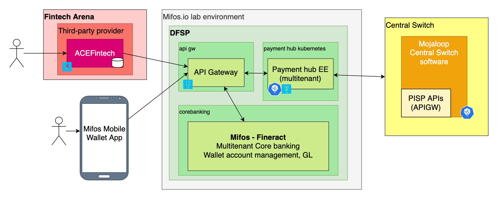

# Mifos Wallet Solution

The Mifos Wallet solution makes use of Fineract 1.x as the core back end banking system with the Mifos User Interface\(s\) for operations and consumer interactions.

As of Sept 9th, 2020, _Fineract 1.4_ \(a derivative of the Mifos X code contributed to Apache Software Foundation\) source code is available here --&gt; [https://github.com/apache/fineract/tree/1.4.0](https://github.com/apache/fineract/tree/1.4.0). A full lab environment with demo servers to test these systems is available; please request access via the [mifos.slack.com channel](https://join.slack.com/t/mifos/shared_invite/zt-frxj913a-VdiJRCNp6M6S9is_Aa2Ikg). Fineract is a core banking system, with APIs that cover accounts, transactions, customers, products, interest schemes, cron jobs, users, authentication, etc.

The _Mifos Payment Hub EE_ is used to connect to Mojaloop \(payments switch\) for inbound and outbound transactions. Payment Hub EE implements the Mojaloop API and maps to the [Fineract API](https://demo.fineract.dev/fineract-provider/swagger-ui/index.html). See \[payment-hub-ee\] for more info.

The [Mifos Wallet App](https://github.com/openMF/mobile-wallet) connects via a WSO2 API Gateway. This is under development and appropriate for prototyping. Again, contact the [mifos.slack.com](https://join.slack.com/t/mifos/shared_invite/zt-frxj913a-VdiJRCNp6M6S9is_Aa2Ikg) channel for access and configuration. Source code is available here:

The API gateway built on WSO2 allows for new channel development on top of the Payment Hub EE.

