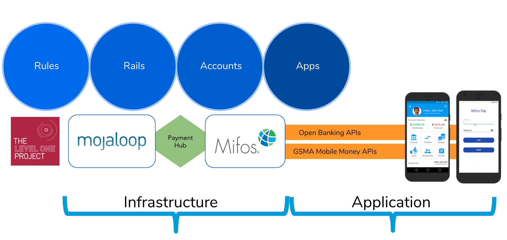

# Vision

Payment Hub EE is at the heart of our end to end open source architecture for digital financial services providing the critical point of integration between the layers of the digital rail for payments interoperability, Mojaloop, and account management layer, Mifos. It brings together two highly complementary open source platforms, Mifos and Mojaloop, fueling innovation on top of these digital rails.

Four layers of Open APIs at the both the infrastructure level as well as the application level provide the necessary architecture in which to rapidly build innovative digital financial services. At the infrastructure level, one can build an entire digital financial services ecosystem, powering the switch and real-time payment system with the Mojaloop Open API and open source core banking from the ground up with Mifos and Fineract to build DFS platforms or entire back-office solutions. At the application layer, we provide a set of reference channel applications (mobile banking, mobile wallets, online banking) along with an Open Banking API layer and integration with OTT APIs like GSMA Mobile Money API to enable third party fintechs to build apps securely accessing data from these customers.

\
