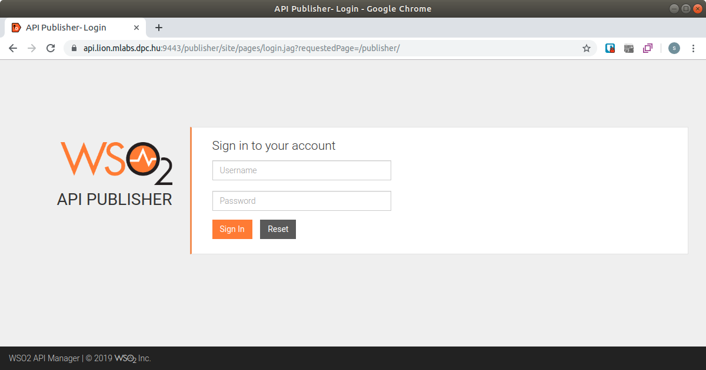
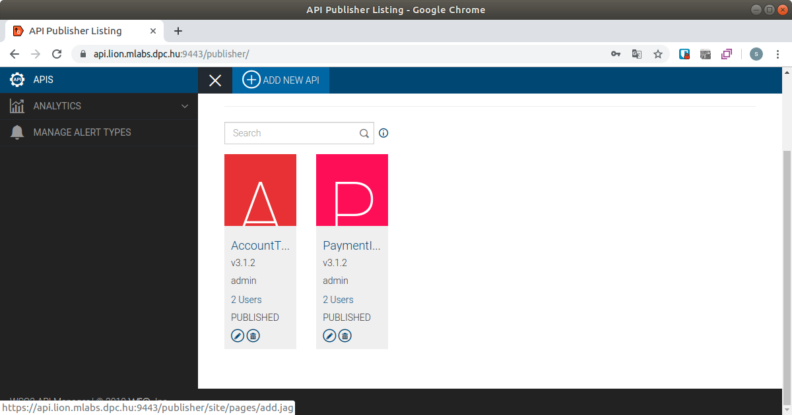
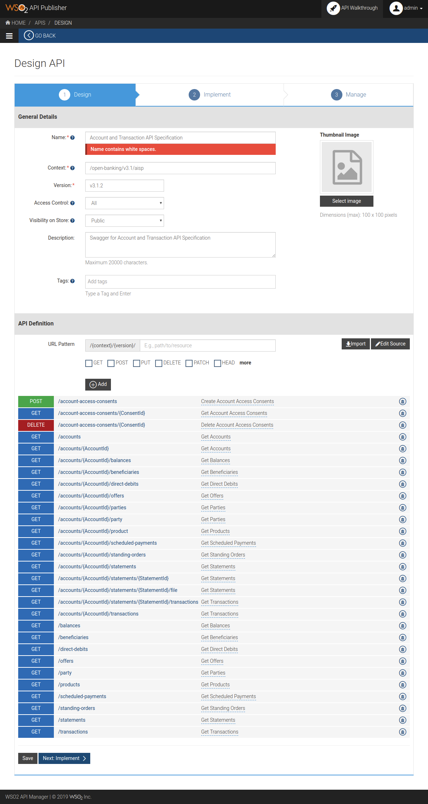

# How to import swagger file to API store

#### Login API publisher [https://api.lion.mlabs.dpc.hu:9443/publisher](https://api.lion.mlabs.dpc.hu:9443/publisher/site/pages/login.jag?requestedPage=/publisher/)

#### Add new API

#### Choose "I Have an Existing API"

Select "Swagger File" option and browse the required Swagger YAML file.  
After click "Start Creating" button.

#### WSO2 import and parsing Swagger file, after show the next screen.

Unfortunately the "Name" field doesn't contains space. You must review this field.

* Name
* Context
* Version
* Access Control
* Visibility on Store
* Description
* Tags
* Thumbnail Image

**We use the following settings in this demo.**

**Demo section**

| Field | Value |
| :--- | :--- |
| Access Control | All |
| Visibility on Store | Public |

**Implement section**

| Field | Value |
| :--- | :--- |
| Endpoint type | HTTP/REST Endpoint |
| Load Balanced | unchecked |
| Failover | unchecked |
| Endpoint Security Scheme | Not Secured |
| Enable Message Mediation | unchecked |
| Enable API based CORS Configuration | unchecked |

**Manage section**

| Group | Field | Value |
| :--- | :--- | :--- |
| Configurations | Make this the Default version | unchecked |
|  | Transports | HTTPS, HTTP |
|  | Response Caching | Disabled |
|  | Authorization Header | \(empty\) |
| Throttling Settings | Maximum Backend Throughput | Unlimited |
|  | Subscription Tiers | Unlimited |
|  | Advanced Throttling Policies | Apply per Resource |
| API Gateways | Production and Sandbox | checked |
| Business Information | \(we not used\) |  |
| API Properties | \(we not used\) |  |

