# Signup and subscribe APIs as TPP/FPP


Signup process is almost same for TPP and FPP.


## Signup at developer portal

**Go to developer portal**: [https://api.lion.mlabs.dpc.hu:9443/store](https://api.lion.mlabs.dpc.hu:9443/store) for Lion, [https://api.elephant.mlabs.dpc.hu:9443/store](https://api.elephant.mlabs.dpc.hu:9443/store) for Elephant bank.

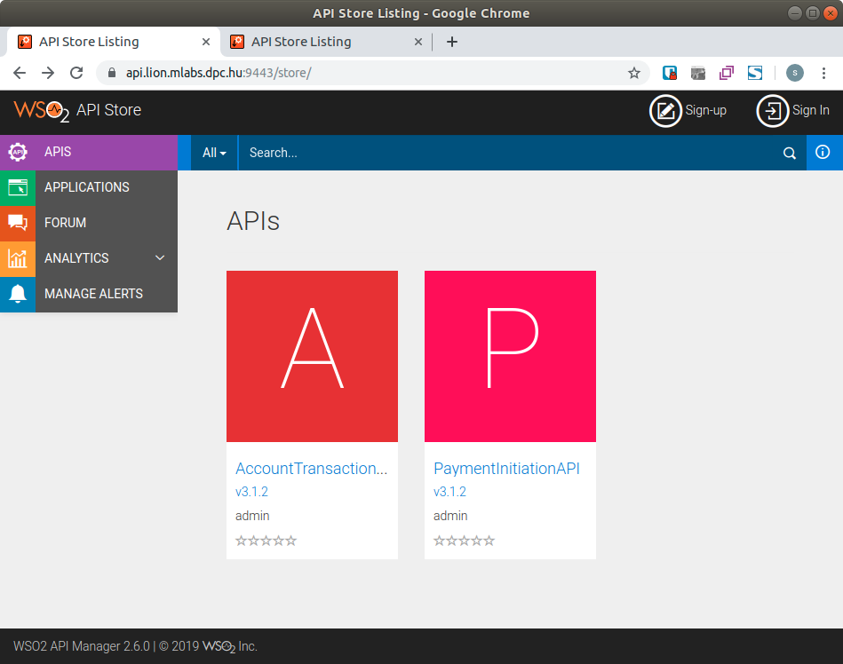

**Give the required fields.**

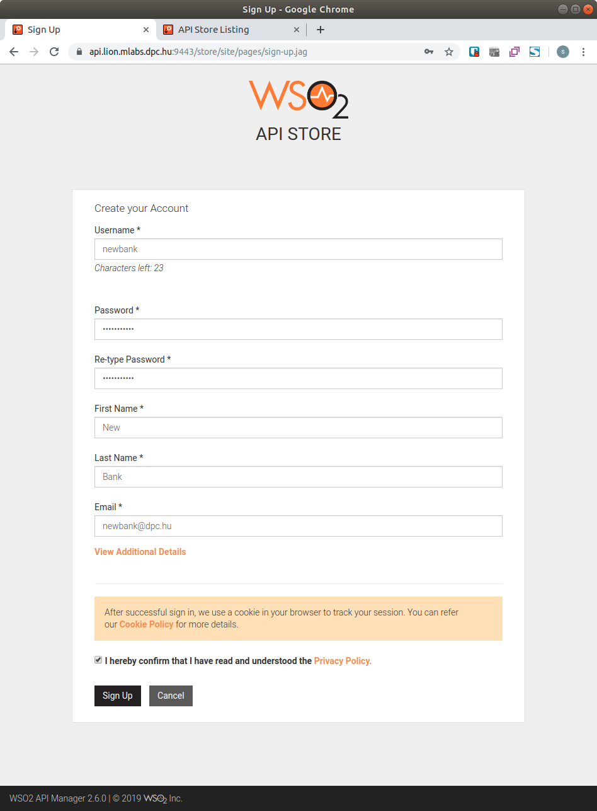

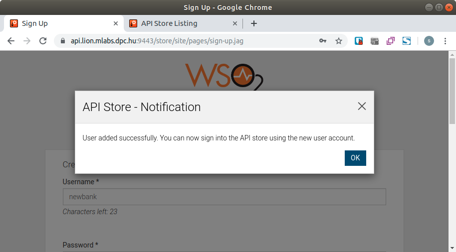

**You must login with the newly created username and password.**

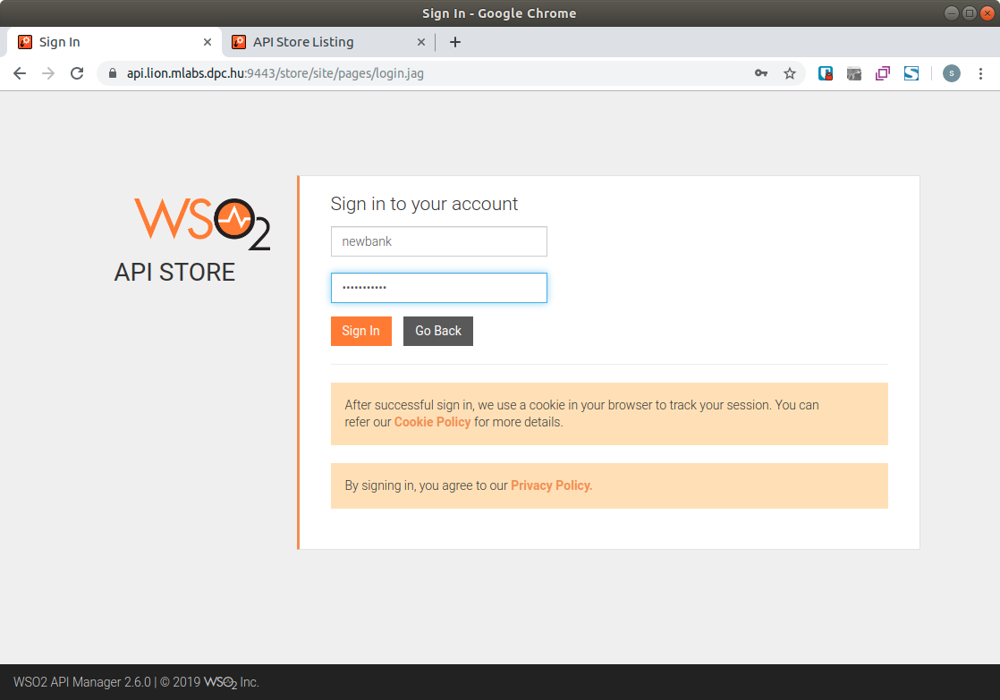

**After login you may see the following screen.**

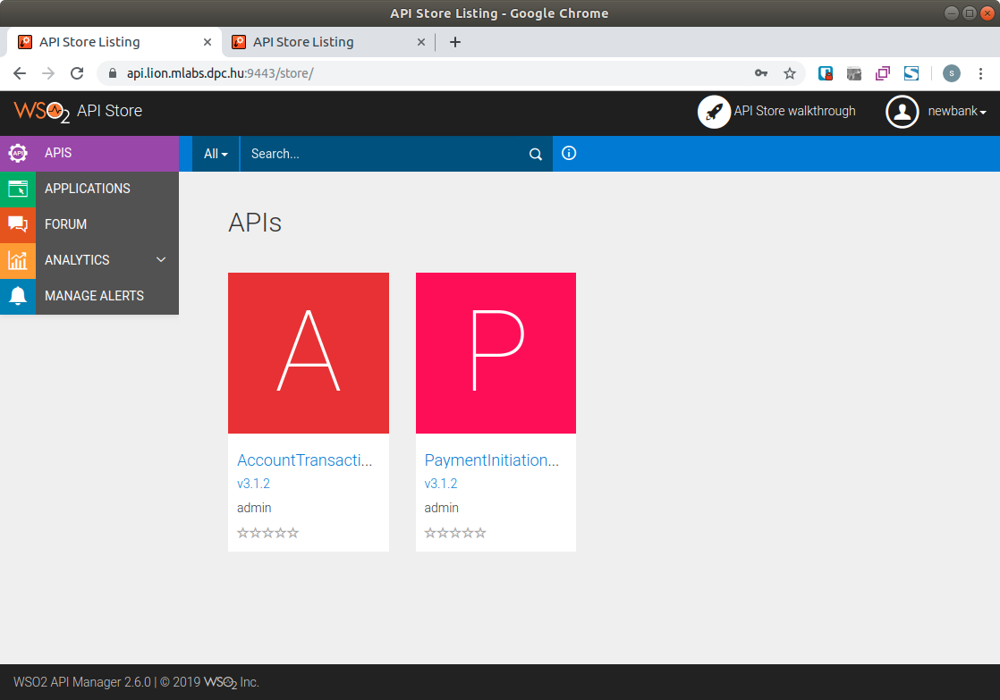

**You must select "Application" menu at left side.**

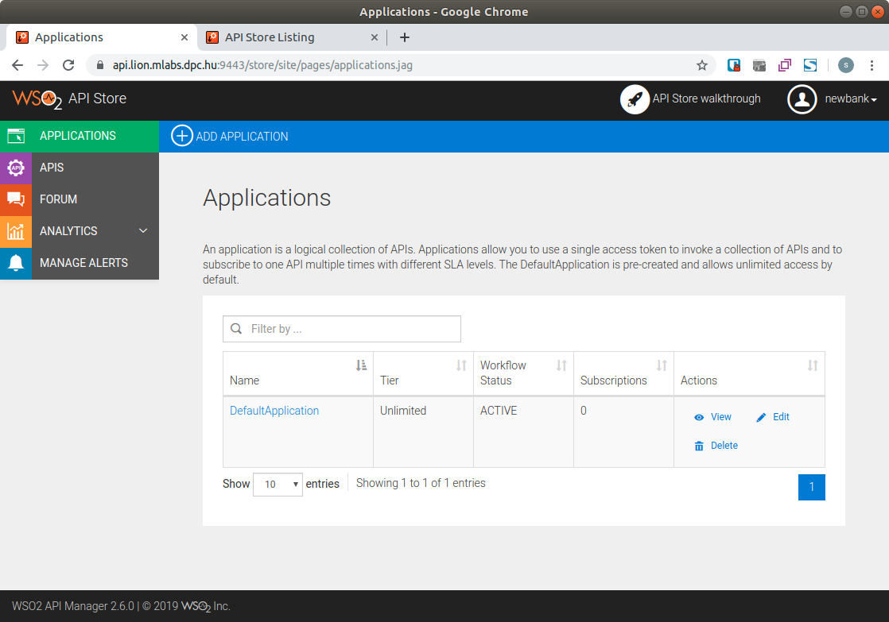

**Select "Edit" action for "DefaultApplication" and modify "Application name".**  
Token type must be "OAuth" in this demo.

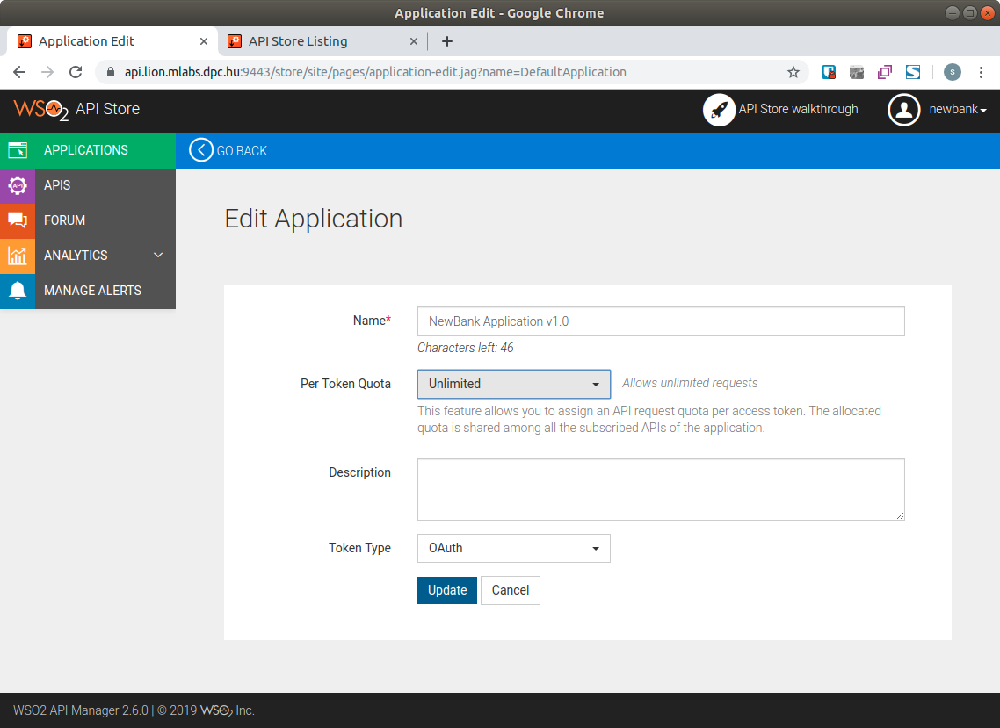

**Select "APIS" menu at left side.**  
Maybe you can see the following APIs.

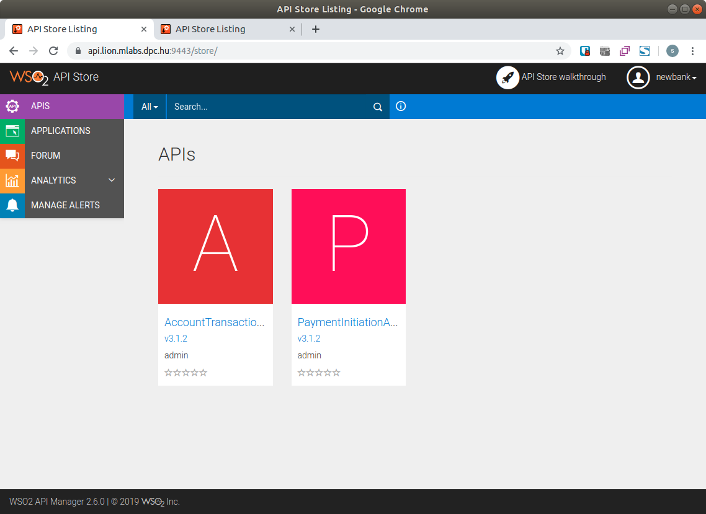

**Select "AccountTransactionAPI - v3.1.2"**

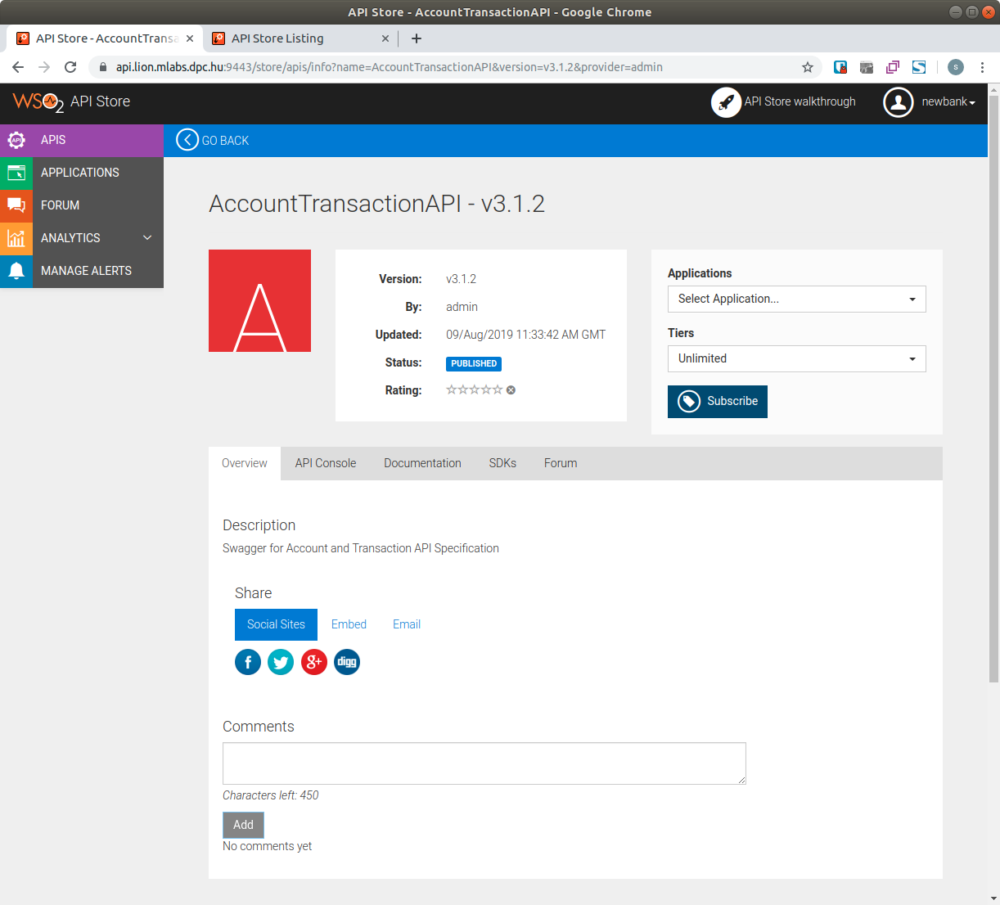

**Select "NewBank Application v1.0" at "Application" dropdown and "Subscribe".**

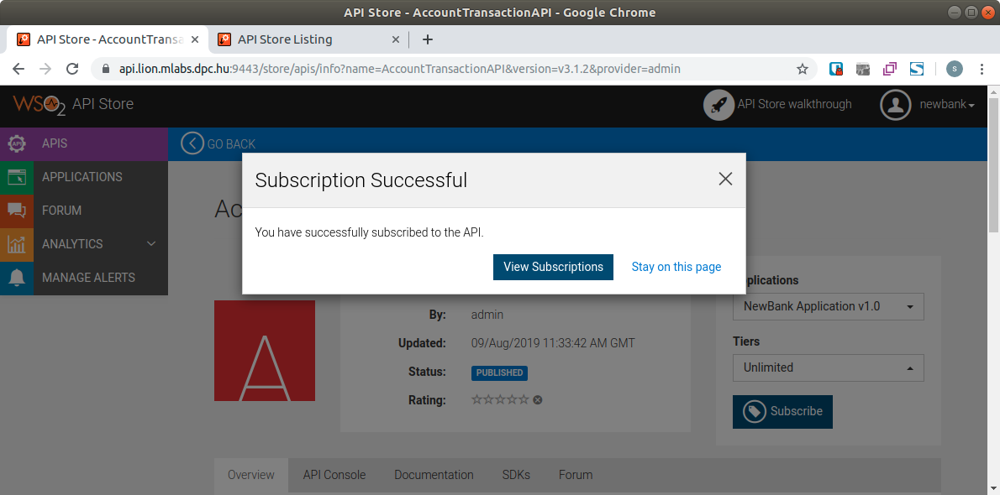

**Go back to APIS screen and subscribe to "PaymentInitiationAPI - v3.1.2".**  
After subscribe APIs in the Application subscriptions screen you can see the following.

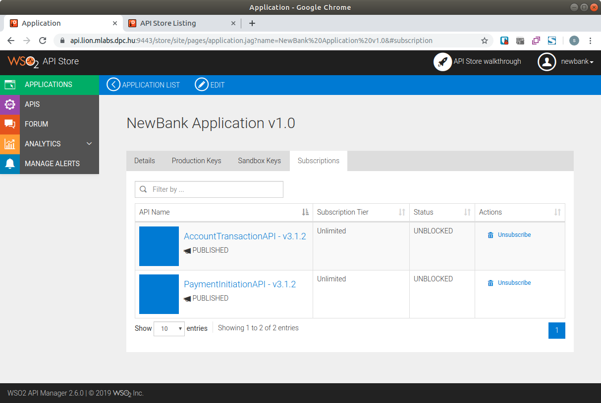

**Go to "Production Keys" tab.**

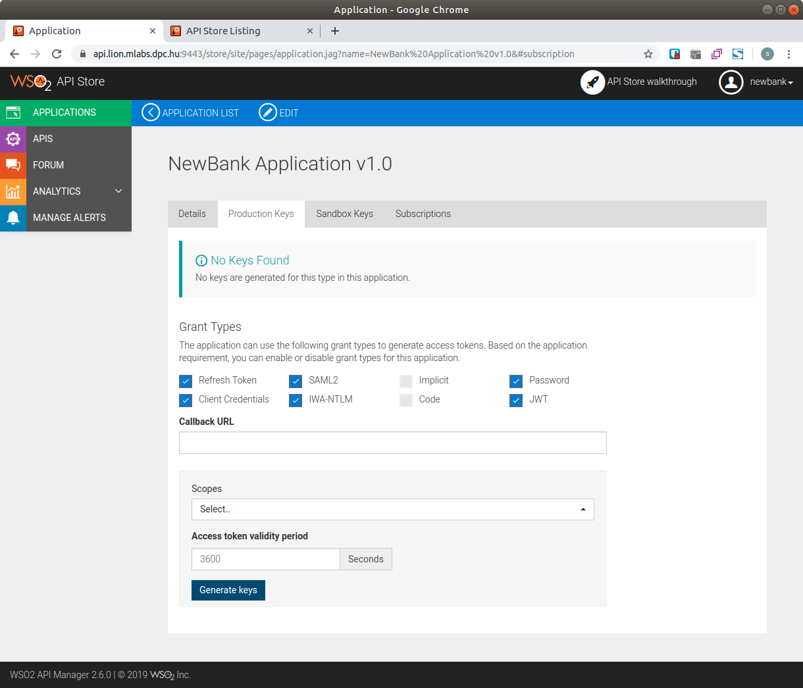

**You must specify "Callback url"** where your application will handle OAuth callback requests, when returned after "bank user" authorized one of the consent screen while using TPP application or handle after login while using FPP application.  
If you change this callback url, you must change in your application to.

**Click "Generate keys" to save changes.**  
After keys generated you must see a similar screen.

In this screen appearing to very imported fields "Consumer Key" and "Consumer Secret". This values require to call OAuth calls. You must save this values. This values is maybe changing while changing "Grant Types" or "Callback URL". Please double check this values after changing something in this page.

If "Consumer Key", "Consumer Secret" or "Callback URL" will not same while call OAuth requests your requests will fail.

Now you have got all information to get Access token and call Application level APIs \(eg. consent requests\).

