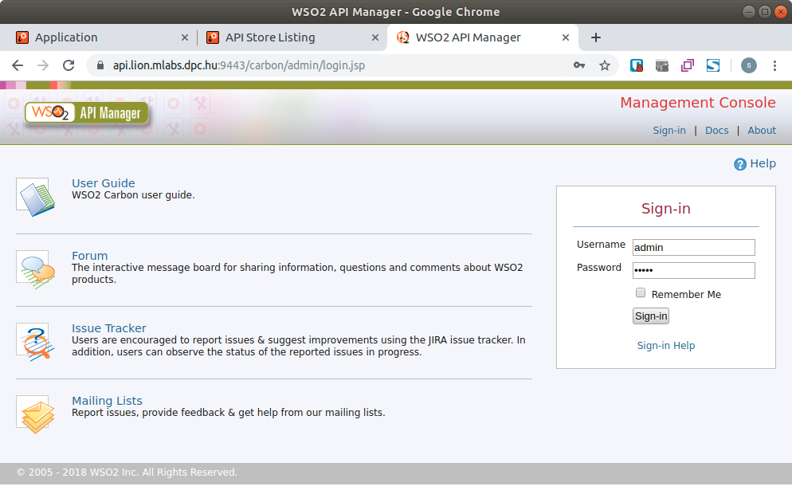
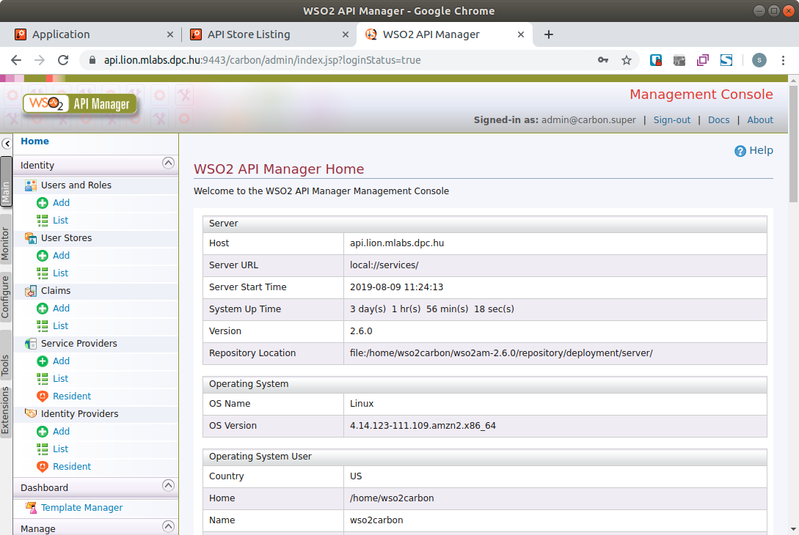
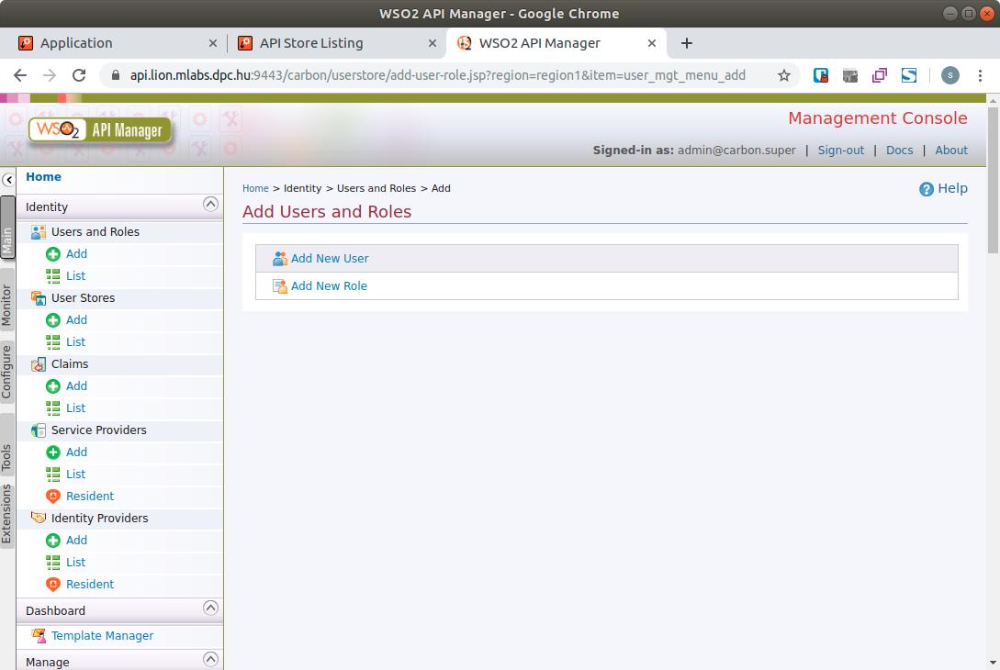
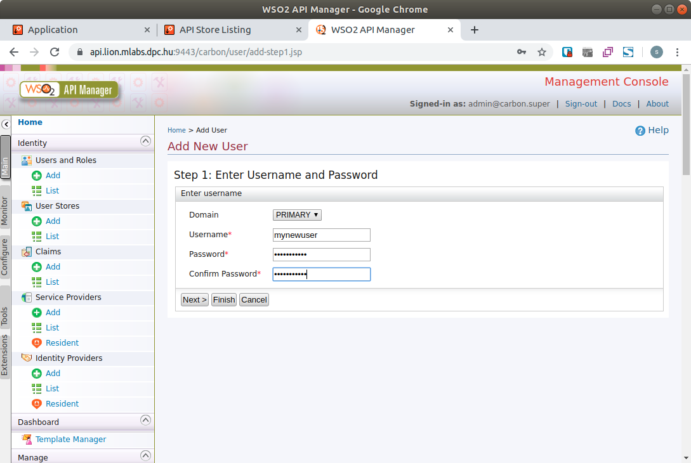
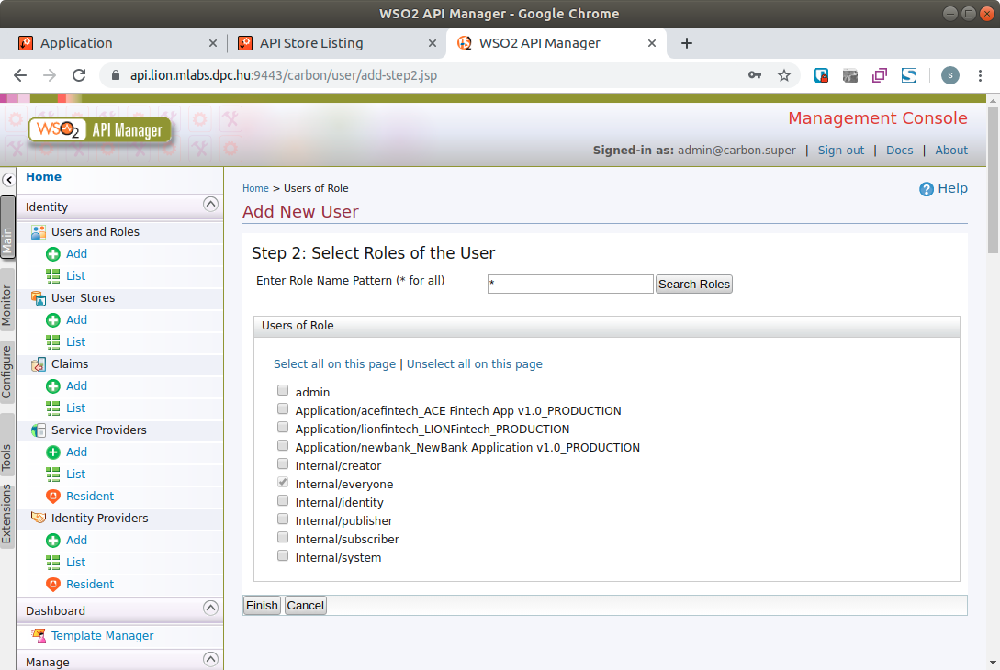

# How to add new bank user

In our demo application and environment, we not create screen workflow to manage bank users.

## Create user in WSO2

**As admin you can login to** [WSO2 management console](configure-ec2-instance-for-wso2-apigateway/default-passwords-and-urls.md): [https://api.lion.mlabs.dpc.hu:9443/carbon/](https://api.lion.mlabs.dpc.hu:9443/carbon/) \(Lion bank\) or [https://api.elephant.mlabs.dpc.hu:9443/carbon/](https://api.elephant.mlabs.dpc.hu:9443/carbon/) \(Elephant bank\).

**Select "Add" at "Users and Roles"**

**Select "Add New User"**  
Fill the required datas and select "Next&gt;" button.

**You can change role assignment.**  
In our demo we not using any roles, keep "Internal/everyone" checked, and select "Finish" button.

## TODO You must assign username with Fineract account at OpenBanking gateway

